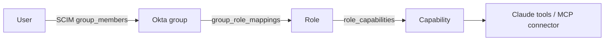

# Enterprise AI Access Lab

A small Claude-powered chat app whose access is controlled by an enterprise IdP (Okta).
It mirrors the identity layer of Claude Enterprise: SCIM provisioning, SAML SSO,
group-based roles, and an audit log. It's a learning and portfolio project, not a product.

| Phase | Scope | Status |
|---|---|---|
| 1 | SCIM 2.0 server (RFC 7643/7644) | ✅ done |
| 2 | SAML SSO with Okta | ✅ done |
| 3 | Group → role → Claude tool mapping | ✅ done |
| 4 | Deprovisioning + audit log | ✅ done |
| 5 | Docs, threat model, demo script | planned |

## Quick start

```bash
cp .env.example .env            # then set SCIM_BEARER_TOKEN (openssl rand -hex 32)
docker compose up -d            # Postgres 16 with access_lab and access_lab_test databases
npm install
npm run db:migrate
npm test                        # runs against TEST_DATABASE_URL (wiped on each test)
npm run dev                     # http://localhost:3000
```

Requires Node 20+.

## SCIM

Base path: `/scim/v2`. Every request except the discovery endpoints needs
`Authorization: Bearer $SCIM_BEARER_TOKEN`. Responses use `application/scim+json`, and
errors use the SCIM error format:

```json
{ "schemas": ["urn:ietf:params:scim:api:messages:2.0:Error"], "status": "409", "scimType": "uniqueness", "detail": "..." }
```

| Endpoint | Methods | Notes |
|---|---|---|
| `/Users` | GET, POST | `filter=userName eq "..."` (also `externalId`, `emails.value`), `startIndex`, `count` (max 200) |
| `/Users/{id}` | GET, PUT, PATCH, DELETE | PATCH returns the updated user (200) |
| `/Groups` | GET, POST | `filter=displayName eq "..."` (also `externalId`), `excludedAttributes=members` |
| `/Groups/{id}` | GET, PUT, PATCH, DELETE | PATCH returns 204 |
| `/ServiceProviderConfig`, `/Schemas`, `/ResourceTypes` | GET | static, no token needed |

Code layout:

```
app/scim/v2/**/route.ts   thin Next.js route handlers
lib/scim/http.ts          bearer auth, SCIM errors, JSON helpers
lib/scim/users.ts         user CRUD + PATCH
lib/scim/groups.ts        group CRUD + membership PATCH
lib/scim/patch.ts         PatchOp parsing, Okta/Entra normalisation
lib/scim/query.ts         filter + pagination
lib/auth/saml.ts          node-saml config + Postgres request-ID store
lib/auth/session.ts       Postgres sessions (create, look up, revoke)
lib/auth/guard.ts         session + capability check for API routes
lib/authz/                capabilities, access resolution, custom roles
lib/tools/                mock GitHub/CRM tools and the tool registry
lib/chat/run.ts           Claude tool-use loop with per-call authorization
lib/audit.ts              audit writes and queries
app/admin/audit/          admin page for the audit log
app/auth/**               login, ACS, metadata, logout routes
db/schema.sql             all tables; db/seed.sql has the default roles
```

### Okta vs Entra ID differences handled

| Behaviour | Okta | Entra ID |
|---|---|---|
| Deactivate | `{"op":"replace","value":{"active":false}}` (no path) | `{"op":"Replace","path":"active","value":"False"}` |
| Op casing | lowercase | Capitalised |
| Booleans | JSON booleans | sometimes strings (`"False"`) |
| Remove group member | `path: members[value eq "<id>"]` | `path: members`, `value: [{"value":"<id>"}]` |
| Rename group | no path, `value: {id, displayName}` | `path: displayName` |
| Email updates | `emails[primary eq true].value` | `emails[type eq "work"].value` |
| Extra attributes | — | enterprise extension paths (ignored, not rejected) |

### Idempotency

IdPs retry on timeouts, so every operation is safe to repeat:

- **POST** of an existing userName returns `409 uniqueness`. Okta and Entra respond by
  looking the user up with `filter=userName eq "..."` and carrying on.
- **PUT** is a full replace, so the same body gives the same result.
- **PATCH** membership adds use `ON CONFLICT DO NOTHING`; removing a non-member is a no-op;
  repeating `active: false` is a no-op. PATCHes lock the row, so concurrent ones apply in order.
- **DELETE** returns 204, then 404 on repeat (required by RFC 7644 §3.6). Both IdPs treat a
  404 on delete as success.

## Running Okta's SCIM test suite

Okta publishes a SCIM 2.0 spec test and a CRUD test (as API-monitoring / Postman collections)
on developer.okta.com under *Test your SCIM API*. To run them against this server:

1. Expose the local server: `cloudflared tunnel --url http://localhost:3000`
   (or `ngrok http 3000`). Set `APP_BASE_URL` in `.env` to the tunnel URL and restart.
2. Import Okta's test collection into the tool the docs point to, and set its variables:
   - `SCIMBaseURL` = `https://<your-tunnel>/scim/v2`
   - `auth` = `Bearer <SCIM_BEARER_TOKEN>`
   - `UserIdServerSupported` / `filterOp` = `true` / `eq`
3. Run the spec test. It creates random users, filters for them, paginates, updates and
   deactivates them.
4. For an end-to-end check, create a SCIM app integration in your Okta developer tenant
   (*Applications → Create App Integration → SAML 2.0*, then enable SCIM provisioning), set the
   connector base URL and bearer token, enable *Create/Update/Deactivate Users* and *Push
   Groups*, and assign a test user.

Useful manual checks:

```bash
T="Authorization: Bearer $SCIM_BEARER_TOKEN"
curl -s localhost:3000/scim/v2/ServiceProviderConfig
curl -s -H "$T" 'localhost:3000/scim/v2/Users?filter=userName%20eq%20%22ada@example.com%22'
```

## Identity matching (SCIM ↔ SAML)

SCIM creates the user; SAML logs them in. The two are joined on **one field: the lowercased
email** in `users.email`.

- **SCIM:** `email` comes from the primary `emails[].value`, falling back to `userName` if it
  looks like an email. A user with neither is rejected (400), since they could never log in.
- **SAML:** the assertion's `email` attribute (name set by `SAML_EMAIL_ATTRIBUTE`), falling back
  to an email-format NameID, is lowercased and looked up in the same column.
- **No just-in-time provisioning.** A valid assertion for someone SCIM never created, or has
  deactivated, gets a 403. The IdP's assignment is the only way in.
- **Groups come from SCIM, not the assertion.** The assertion's `groups` are stored on the
  session for debugging only. Authorization reads `group_members`, so a group change pushed
  by SCIM applies on the next request instead of at the next login.
- In Okta, use the same source for both sides: map `user.email` to the SCIM `emails` value
  *and* to the SAML `email` attribute. If they drift apart, login fails closed (403) rather
  than signing in the wrong person.

## SAML SSO

SP-initiated only. All SAML parsing and XML-signature checks are done by
[`@node-saml/node-saml`](https://github.com/node-saml/node-saml); this app has no XML code.

| Route | Purpose |
|---|---|
| `GET /auth/saml/login?returnTo=/path` | Builds an AuthnRequest, stores its ID, redirects to Okta |
| `POST /auth/saml/acs` | Validates the signed response, creates a session, sets the cookie |
| `GET /auth/saml/metadata` | SP metadata (entity ID + ACS URL) |
| `POST /auth/logout` | Revokes the session server-side and clears the cookie |
| `GET /api/me` | Current user and SCIM groups, or 401 |

What a response must pass before a session is created:

- **Signed assertion** from the configured Okta certificate (`wantAssertionsSigned`). Unsigned,
  tampered, or other-key assertions are rejected.
- **Audience** equals our SP entity ID, so an assertion minted for another app can't be reused here.
- **Time window** (`NotBefore`/`NotOnOrAfter`, 30s clock skew).
- **InResponseTo** matches an AuthnRequest we sent in the last 5 minutes. IDs live in the
  `saml_requests` table and are deleted on use, which blocks replayed responses and
  IdP-initiated (unsolicited) logins.
- **User** exists in SCIM with that email and `active = true`.
- `RelayState` is only honoured if it is a same-site path, so it can't be used as an open redirect.

### Sessions

Sessions live in the `sessions` table so they can be revoked:

- The cookie holds 32 random bytes. Only its SHA-256 is stored, so a leaked table can't be
  replayed as cookies.
- Cookie flags: `HttpOnly`, `SameSite=Lax`, `Secure` when `APP_BASE_URL` is https.
- Every request looks the session up again, joining `users.active`, so revoking a session or
  deactivating the user takes effect on the next request. Absolute lifetime is
  `SESSION_TTL_HOURS` (default 8).
- `revokeUserSessions(userId)` exists for Phase 4 (deprovisioning).

### Okta setup

1. Start a tunnel: `cloudflared tunnel --url http://localhost:3000`. Put the https URL in
   `APP_BASE_URL`.
2. In Okta: **Applications → Create App Integration → SAML 2.0**.
   - Single sign-on URL: `https://<tunnel>/auth/saml/acs`
   - Audience URI (SP Entity ID): the value of `SAML_SP_ENTITY_ID`, e.g. `https://<tunnel>/auth/saml/metadata`
   - Name ID format: EmailAddress; Application username: Email
   - Attribute statement: `email` → `user.email`
   - Group attribute statement: `groups`, filter *Matches regex* `.*` (or narrower)
   - Leave "Response" unsigned and "Assertion Signature" signed (Okta's defaults).
3. From **Sign On → View SAML setup instructions**, copy the SSO URL into `SAML_ENTRY_POINT` and
   the X.509 certificate into `SAML_IDP_CERT`.
4. Assign yourself to the app, make sure SCIM has provisioned you, then open
   `https://<tunnel>/` and click **Sign in with Okta**.

Tests (`tests/auth.test.ts`) use a fake IdP (`tests/fake-idp.ts`) with throwaway keys in
`tests/fixtures/` to sign responses, including forged, replayed, expired and wrong-audience ones.

## Roles and tool access

Modeled on Claude Enterprise custom roles: **groups → roles → capabilities → tools**.
Users never get a role directly. Access always comes from Okta group membership, which
SCIM keeps in sync.



Default roles (seeded once into an empty database from `db/seed.sql`):

| Okta group | Role | Capabilities | Claude gets |
|---|---|---|---|
| Lab Users | viewer | `chat` | no tools |
| Engineering | engineer | `chat`, `tool:github` | `github_search_issues`, `github_get_pull_request` |
| Sales | sales | `chat`, `tool:crm` | `crm_lookup_account`, `crm_list_opportunities` |
| Lab Admins | admin | `chat`, `admin:roles` | no tools; can manage roles |

Roles are unioned across groups. A user whose groups map to no role gets **nothing, not even
chat** (fail closed). Capabilities are a fixed list in `lib/authz/capabilities.ts`, so a role
can't be granted something the code doesn't enforce. The GitHub and CRM tools return mock data.

### How it's enforced

1. **Claude only sees allowed tools.** `/api/chat` resolves the user's capabilities from the
   database and passes Claude only the matching tool definitions. The system prompt names the
   user's roles so Claude can explain missing access instead of guessing.
2. **Every tool call is re-authorized before it runs.** Between tool-use turns the capabilities
   are re-read. A tool Claude wasn't offered, invents, or lost access to mid-conversation
   returns an `is_error` tool result saying permission was denied. It is never executed.
3. **MCP connectors are gated by attaching them or not.** Remote MCP tools run on Anthropic's
   side, so there is no execute step to intercept. The docs connector (`MCP_DOCS_URL`) is only
   added to the request (`mcp_servers` + `mcp_toolset`) for roles with `connector:docs`.
4. **No caching anywhere.** Capabilities are resolved per request (and per tool turn), so a
   SCIM group change or a role edit applies on the next request, without a re-login.
5. **The client can't widen access.** The browser sends the transcript, but the tool list and
   tool execution are decided on the server.

The chat loop is a manual tool-use loop (`lib/chat/run.ts`) rather than the SDK's tool runner,
so the authorization check sits visibly in the loop. It calls `claude-opus-5-5` (override with
`CLAUDE_MODEL`) at `effort: medium`, with `fallbacks: "default"`: if a safety classifier
declines a request, the API retries it server-side on Anthropic's recommended fallback model.
A refusal that still stands is reported to the user as such.

### Admin API (custom roles)

Requires the `admin:roles` capability.

| Route | Purpose |
|---|---|
| `GET /api/admin/roles` | Roles with capabilities and mapped groups, plus the capability catalog |
| `PUT /api/admin/roles/{name}` | Create or replace a role: `{ "description", "capabilities": [...], "groups": [...] }` |
| `DELETE /api/admin/roles/{name}` | Delete a role |

A change that would leave no group mapped to a role with `admin:roles` is rejected with 409,
so admins can't lock themselves out.

```bash
# Give an Okta "Support" group chat + CRM tools
curl -X PUT -b "lab_session=..." -H 'content-type: application/json' \
  https://<tunnel>/api/admin/roles/support \
  -d '{"description":"Support agents","capabilities":["chat","tool:crm"],"groups":["Support"]}'
```

## Deprovisioning

When Okta (or Entra) removes someone, access ends on their **next request**, not when their
session would have expired:

| IdP action | SCIM call | What happens here |
|---|---|---|
| Deactivate / unassign | `PATCH active:false` (or `PUT` with `active: false`) | In one transaction: user marked inactive, **all their sessions revoked**, audit entries written |
| Delete | `DELETE /Users/{id}` | Sessions revoked and counted, audit entry written, user row deleted |
| Remove from a group | `PATCH /Groups/{id}` members | Capabilities recomputed on the next request or tool turn (Phase 3) |

There are three independent safeguards, so a single missed step doesn't leave access open:

1. **Sessions are revoked** (`revoked_at` set) in the same transaction as the deactivation.
2. **Every session lookup joins `users.active`**, so even an unrevoked session stops working.
3. **`accessFor()` ignores inactive users**, so a chat request already in progress can't run
   another tool after the user is deactivated.

Reactivating a user doesn't bring old sessions back; they sign in again.

## Audit log

`audit_log` is **append-only in the database**: triggers reject `UPDATE`, `DELETE` and
`TRUNCATE`. Each entry has `actor`, `action`, `target`, `occurred_at` and `metadata` (JSON,
including the client IP). Entries that record a data change are written in the **same
transaction** as the change, so a change can't commit without its entry. No-op retries
(for example Okta repeating the same PATCH) aren't logged.

| Action | Actor | Target | Metadata |
|---|---|---|---|
| `scim.user.create` / `update` / `deactivate` / `reactivate` / `delete` | `scim` | `user:<id>` | userName, changed fields, `sessionsRevoked` |
| `scim.group.create` / `rename` / `delete` | `scim` | `group:<id>` | names, member count |
| `scim.group.member_add` / `member_remove` | `scim` | `user:<id>` | group name and id |
| `auth.login` / `auth.logout` | `user:<email>` | `user:<id>` | IdP groups, session expiry |
| `auth.login_failed` | `user:<email>` or `anonymous` | – | reason (bad signature, replay, not provisioned…) |
| `role.create` / `update` / `delete` | `user:<email>` | `role:<name>` | before and after |
| `claude.tool_call` / `claude.tool_call_failed` | `user:<email>` | `tool:<name>` | input (capped at 2 KB), capability, `denied`, output size |
| `admin.audit.query` / `admin.audit.view` | `user:<email>` | – | the filters used |

Design choices:

- Group membership changes are filed under the **user** (`target = user:<id>`), because joining
  a group can grant a role. Filtering by one user's target gives their whole history:
  provisioning, privilege changes, logins, tool calls (by actor) and deprovisioning.
- Tool **outputs aren't stored**, only their size, since they can hold customer data.
- Reading the audit log is itself audited.
- No foreign keys, so entries outlive deleted users and groups.

### Reading it

Requires the `admin:audit` capability (the seeded `admin` role has it).

```
GET /api/admin/audit?actor=&action=<prefix>&target=&since=&until=&limit=&before=<id>
```

Results are newest first, up to 500 per page. `action` matches by prefix (`scim.` returns every
SCIM event). For the next page, pass the returned `nextBefore` as `before`. There is no write
endpoint.

The admin page at **`/admin/audit`** shows the same data with filters, and clicking an actor or
target filters by it.

## Limitations (on purpose, for size)

- Filters: only `attr eq "value"`. Others return `400 invalidFilter` instead of being ignored.
- No bulk, sort, or `If-Match` enforcement (advertised as unsupported in ServiceProviderConfig).
- One static bearer token. Production would use per-IdP tokens with rotation.
- Users are hard-deleted on DELETE. Deactivation (`active: false`) keeps the row.
- No SAML Single Logout: signing out here doesn't end the Okta session, and vice versa.
- No encrypted assertions (the transport is TLS; add `decryptionPvk` if your IdP requires it).
- Chat isn't streamed and transcripts aren't stored server-side.
- The client IP comes from `X-Forwarded-For`, which is only trustworthy behind a proxy
  you control (the tunnel). Without one, clients can spoof it.
- The audit log isn't tamper-evident (no hash chain), and there is no retention or export
  job. The triggers stop the app from editing it, but a database superuser still could.
- Group-to-role mappings use group names, so renaming a group in Okta removes its access until
  the mapping is updated.
